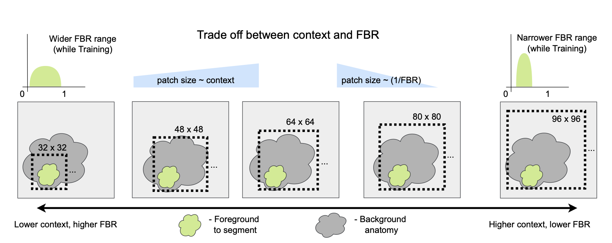

# Context versus Foreground Ratio trade-off for 3D Image Segmentation

  

This repository contains experiments associated with the [Medical Image meets NeurIPS 2022 Workshop abstract](http://www.cse.cuhk.edu.hk/~qdou/public/medneurips2022/72.pdf):

**"How do 3D image segmentation networks behave across the context versus foreground ratio trade-off?"**  
*Amith Kamath, Yannick Suter, Suhang You, Michael Müller, Jonas Willmann, Nicolaus Andratschke, Mauricio Reyes*



🔗 [Project Website](https://amithjkamath.github.io/projects/2022-medneurips-contextvsfbr-tradeoff/)

---

## Overview

In 3D medical image segmentation, patch-based processing is a necessity due to GPU memory constraints. However, choosing the patch size introduces a trade-off between:

- **Global context**: Larger patches include more anatomical information.
- **Foreground-to-Background Ratio (FBR)**: Smaller patches are more balanced but may lack context.

This project evaluates how segmentation architectures behave across this trade-off, comparing:

- **Vanilla-Unet**
- **Attention-Unet**
- **UNETR (Transformer-based)**

We evaluate on both synthetic datasets and the spleen segmentation dataset from the [Medical Segmentation Decathlon](http://medicaldecathlon.com/).

---

## Key Findings

- Larger patch sizes (more context) consistently improve performance.
- UNETR and Attention-Unet are more sensitive to changes in FBR at test time.
- Vanilla-Unet shows greater robustness across varying FBR distributions.
- A diverse FBR range during training is crucial for model generalizability.

---

## Setup

### Installation

```bash
git clone https://github.com/amithjkamath/context_vs_fbr.git
cd rcontext_vs_fbr
uv venv .venv
uv pip install -r pyproject.toml
```

## Organization of code

To reproduce these results, run the following:

    run_synthetic_experiments.sh

and 

    run_clinical_experiments.sh

### Dependencies

The dependencies for this project are in the [project file](./pyproject.toml).

### Where to get the clinical data?

The clinical data comes from the [Medical Segmentation Decathlon](http://medicaldecathlon.com), specifically the spleen data set. This data can be downloaded from the organizers' [google drive](https://drive.google.com/file/d/1jzeNU1EKnK81PyTsrx0ujfNl-t0Jo8uE/view?usp=share_link) and needs to be placed in this structure:

```
context_vs_fbr
│   README.md
│   ...
└───data
│   └─── raw
|        └─── Task09_Spleen
└───spleen_experiments
|    │    spleen_3d_wandb_attention_unet.py
|    |    ... unetr.py 
|    └─── ... unet.py 
└───synthetic_experiments
|    │    synthetic_3d_wandb_attention_unet.py
|    |    ... unetr.py 
|    └─── ... unet.py 
...
```

The synthetic data will be generated automatically by the scripts in the `synthetic_experiments` folder and will also be uploaded to wandb for archiving. 

### Reproducing these results

Run the shell scripts as indicated earlier, and then to analyze the results, you could download the CSV files from the individual runs of the test prediction tables on wandb, for example: [here](https://wandb.ai/amithjkamath/MONAI_Spleen_3D_Segmentation_UNet/runs/16qwfmf9?workspace=user-amithjkamath) - look under tables for the 'Export as CSV' option.

Then run the notebooks to generate the graphs, for synthetic experiments:

    synthetic_analysis.py

and for clinical (spleen) experiments:

    spleen_analysis.py

## Weights and Biases runs

We use [weights and biases](https://wandb.ai) to log and track the results of all our experiments. The following public links point to the runs we use for making inferences in this abstract, from where the CSV files are extracted to produce the results and figures used in the paper. These CSV files are copied over in this repository for easy access, but should be downloadable from these runs independently as well.

### Synthetic experiments

Attention-Unet: [wandb project](https://wandb.ai/amithjkamath/MONAI_Synthetic_3D_Segmentation_AttentionUnet?workspace=user-amithjkamath)

UNETR: [wandb project](https://wandb.ai/amithjkamath/MONAI_Synthetic_3D_Segmentation_UNETR?workspace=user-amithjkamath)

Vanilla-Unet: [wandb project](https://wandb.ai/amithjkamath/MONAI_Synthetic_3D_Segmentation_UNet?workspace=user-amithjkamath)

### Clinical (Spleen data set) experiments

Attention-Unet: [wandb project](https://wandb.ai/amithjkamath/MONAI_Spleen_3D_Segmentation_AttentionUnet?workspace=user-amithjkamath)

UNETR: [wandb project](https://wandb.ai/amithjkamath/MONAI_Spleen_3D_Segmentation_UNETR?workspace=user-amithjkamath)

Vanilla-Unet: [wandb project](https://wandb.ai/amithjkamath/MONAI_Spleen_3D_Segmentation_UNet?workspace=user-amithjkamath)

## Have questions?

Please create an issue in this repository, or contact Amith [here](https://amithjkamath.github.io). 

We gratefully acknowledge [MONAI](https://monai.io) and [wandb](https://wandb.ai) for all the great work they've done to create reusable libraries for network construction and reproducible analysis.
